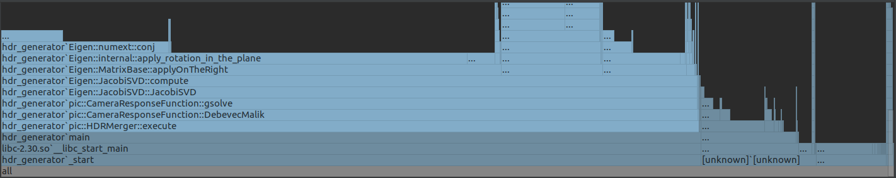
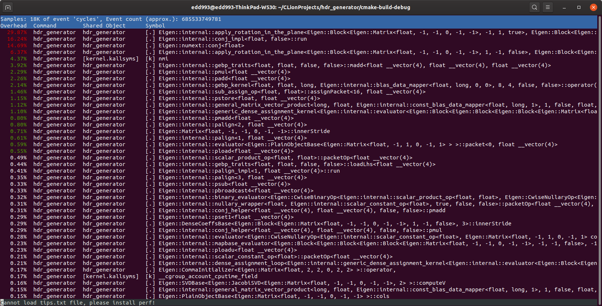
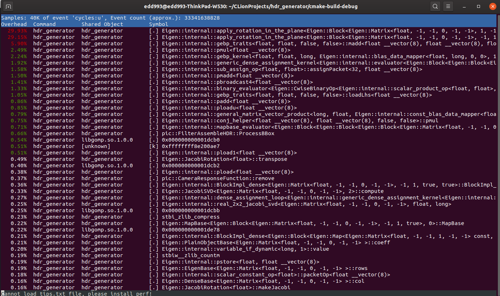
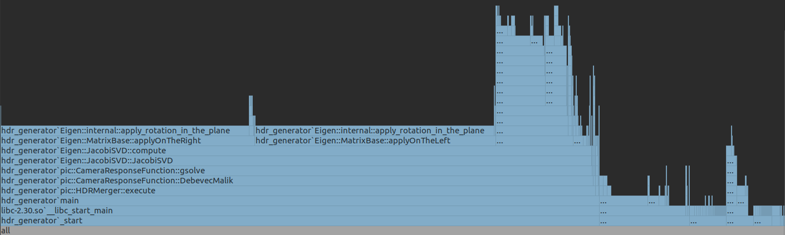
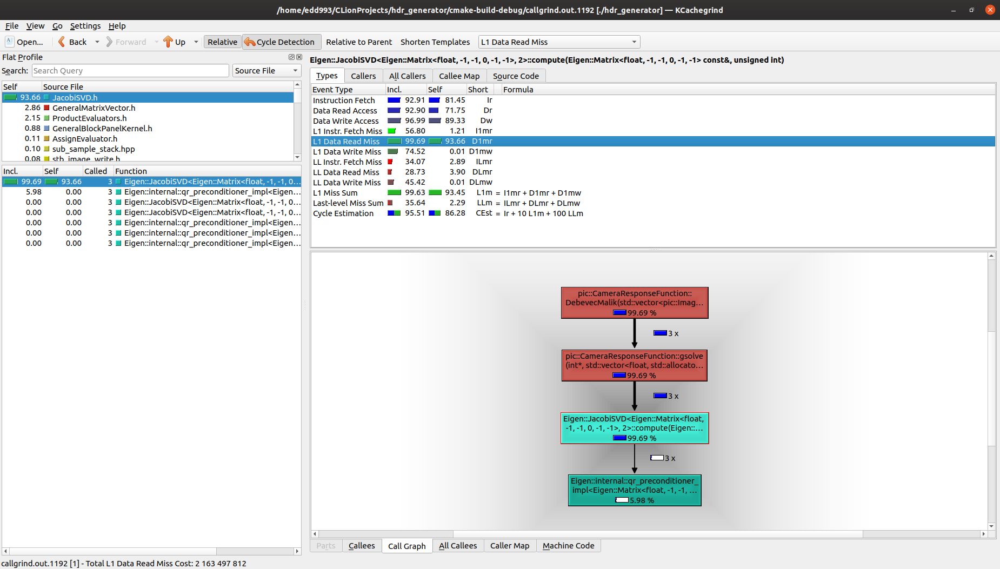
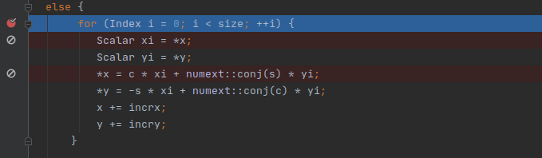

# HPC projet 1 - Optimisation librarie Piccante
### Edoardo Carpita
# Introduction

Pour mon projet personel j'ai choisi de travailler avec une librarie de traitement d'image qui s'appelle Piccante. Cette librarie ecrite en C/C++ permet d'effectuer des traitements d'images avancés.
Dans le cadre specifique de ce projet je vais me concentrer sur une application en particulier, le generateur d'image HDR.
L'imagerie HDR consiste à travailler avec une suite de photos du meme sujet à des niveaux d'expositions differents, pour ensuite effectuer une fusion de l'image avec les pixels de meilleure qualité selon l'algorithme.
Justement parce que j'etais curieux de decouvrir plus sur cette techinque dela photographie, j'ai decidé de travailler sur ce sujet.


J'ai commencé mon travail avec la creation d'un projet Clion avec comme base un programme de test qui permet de fusioner une image de test fournie par les developpeurs de la librairie.
La librarie etant composé principalement de fichiers hpp, l'integration dans mon projet se fait assez facilement. Une fois resolus des problèmes de compilation et adaté correctement le CMakeList.txt, j arrive à compiler et execurter le programme une fois.

Dans mon travail d'optimisation je vais viser un travail "generaliste" (une serie d'images de dimension normales, ni trop grande ou trop petite), et je vise le maximum de performance par rapport à ma machine de travail.

Le programme se lance tout simplement apres la compilation via la commande ./hdr_generator et les images dans data/input sont converties e une seule image HDR dans le dossier data/output

Le repos du projet se trouve ici https://github.com/ecarpita93/HPC_projet_1

# Situation baseline

La première execution du programme, j'utilise les outils vus au cours afin d'effectuer par la suite des comparaisons sur le travail d'optimisation:


## Time

```
time ./hdr_generator

real      1m47.063s
user      1m47.601s
sys        0m0.028s

```

## Perf et flamegraph





En faisant des recherches, je comprends mieux le fonctionnement du programme et la fonctions des differentes fonctions que je peux observer sur la stack du flamegraph. EN bref, afin de generer une image HDR, et donc fusionner les 7 exemplaires à disposition en une seule image optimisé, il est nécessaire de connaitre le "CRF" (Camera response function), qui represente la relation entre le quantité de lumière entrante et les valeurs correspondantes des pixel d'une image de la camera. Cette valeur est estimable à partir de la sequence d'images d'exposition (car les compagnie des camera considerent cette information commerciale et non-divulgable), et pour faire cela un algortitme e été mis en place par les chercheurs Debevec et Malik. Cet algoritme par contre n'est pas completement efficace sans corriger les effets de bruits parassites qui se produisent par echantillonage (comme les images peuvent contenir des aberrations qui polluent le CRF), et la solution à ce problème a été trouvé dans la regularisation des données  et cela s'effectue utilisant un calcul de decomposition en valéurs singulières. Comme on peut observer des données ci dessus, la plus part de temps et de ressources sont dediés dans l'application de cette regularisation des données, mon travail sera donc celui de trouver une facon d'optimiser si possible cette partie du code


# Optimisation 1: compilateur

## Application des optimisations de base:

En ayant crée moi meme le projet et la librarie etant basée sur les headers, aucune optimisation au niveau du compilateur est presente. Je procede donc à rejouter à mon CMakeList des flags afin d'ameliorer le travail de compilation du programme. Je teste plusieurs solutions, dont je trouve la plus performante dans mon cas avec cette configuration:
  - *Ofast* : optimisation génerale de la compilation la plus efficace que j'ai pu tester, elle permet de reduire le temps d'execution de presque 2 minutes à environ 9 secondes
  - *march=native* : optimisation qui indique au compilateur d'optimiser le code par rapport à la machine native ou la compilation a été effectué. Native demande une version de gcc assez recente (gcc 5.4 et plus) mais non seulement ceci permet un gain dans la rapidité de l'execution du programme mais permet aussi une approche plus portable que expliciter l'architecture de ma machine. En plus elle vas s'occuper d'activer tous les instruction set que mon ordinateur est capable de supporter sans devoir les expliciter (donc à priori ceci vas activer la vectorisation du code deja presente dans la libraire).
  - *ffast-math et ftree-vectorize* : optimisation finale, permet de gagner un peu de temps cpu

Deja sans outils d'analyse je remarque que le programme s'execute beaucoup plus rapidement. Avec la commande time je peux reporter les temps effectifs d'execution avec time:

```
real      0m8.616s
user      0m8.768s
sys       0m0.048s

```

## Application des optimisations par profiling automatique:

J'essaie de pousser au maximum la possibilité d'optimisation avec compilateur et j'effectue une nouvelle optimisation avec *-fprofile* afin de generer automatiquement une optimisation sur mesure avec l'outil de profiling integré au compilateur.
Le profiling automatique s'avere une solution fonctionnelle et reduis encore un petit peu le temps d'execution du programme. j'obtiens avec time le temps suivant:

```
real      0m8.219s
user      0m8.590s
sys       0m0.028s

```

# Nouveau profiling manuel

A ce point la je retiens sage de reeffectuer un autre fois les outils de profiling, comme la compilation optimisé a surement engendré des effects sur l'utilisation des ressources du programme. Une nouvelle execution de perf et valgrind me pointe vers les points critiques du programme. (Pour cette partie je desactive l'inlining de l'optimisation avec *-fno-inline* afin de mieux observer les fonctions effectives qui consomment plus de ressources)







Dans ce cas on peut observer que la fonction qui consomme pratiquement toute seule le 7/10 du temps cpu du programme et aussi le plus haut taux de cache read miss est la fonction *apply_rotation_in_the_plane*, qui est appelé dans les fonctions superieures *rotation_right* et *rotation_left*. Ma prochaine etape ca sera donc celle d'etudier un plan d'attaque pour cette fonction pour verifier si c'est possible de l'optimiser.

# Optimisation 2: parallelisation et vectorisation du code critique


## Tentative par modification du code directe

Le code de la fonction critique se trouve donc dans le dossier include/external/Eigen/src/Jacobi et effectue la rotation des données de la matrice utilisé pour le calcul de la decomposition en valeur singulières:

```
void /*EIGEN_DONT_INLINE*/ apply_rotation_in_the_plane(DenseBase<VectorX>& xpr_x, DenseBase<VectorY>& xpr_y, const JacobiRotation<OtherScalar>& j)
{
  typedef typename VectorX::Scalar Scalar;
  enum {
    PacketSize = packet_traits<Scalar>::size,
    OtherPacketSize = packet_traits<OtherScalar>::size
  };
  typedef typename packet_traits<Scalar>::type Packet;
  typedef typename packet_traits<OtherScalar>::type OtherPacket;
  eigen_assert(xpr_x.size() == xpr_y.size());
  Index size = xpr_x.size();
  Index incrx = xpr_x.derived().innerStride();
  Index incry = xpr_y.derived().innerStride();

  Scalar* EIGEN_RESTRICT x = &xpr_x.derived().coeffRef(0);
  Scalar* EIGEN_RESTRICT y = &xpr_y.derived().coeffRef(0);

  OtherScalar c = j.c();
  OtherScalar s = j.s();
  if (c==OtherScalar(1) && s==OtherScalar(0))
    return;

  /*** dynamic-size vectorized paths ***/
  if(VectorX::SizeAtCompileTime == Dynamic &&
    (VectorX::Flags & VectorY::Flags & PacketAccessBit) &&
    (PacketSize == OtherPacketSize) &&
    ((incrx==1 && incry==1) || PacketSize == 1))
  {
    // both vectors are sequentially stored in memory => vectorization
    enum { Peeling = 2 };

    Index alignedStart = internal::first_default_aligned(y, size);
    Index alignedEnd = alignedStart + ((size-alignedStart)/PacketSize)*PacketSize;

    const OtherPacket pc = pset1<OtherPacket>(c);
    const OtherPacket ps = pset1<OtherPacket>(s);
    conj_helper<OtherPacket,Packet,NumTraits<OtherScalar>::IsComplex,false> pcj;
    conj_helper<OtherPacket,Packet,false,false> pm;

    for(Index i=0; i<alignedStart; ++i)
    {
      Scalar xi = x[i];
      Scalar yi = y[i];
      x[i] =  c * xi + numext::conj(s) * yi;
      y[i] = -s * xi + numext::conj(c) * yi;
    }

    Scalar* EIGEN_RESTRICT px = x + alignedStart;
    Scalar* EIGEN_RESTRICT py = y + alignedStart;

    if(internal::first_default_aligned(x, size)==alignedStart)
    {
      for(Index i=alignedStart; i<alignedEnd; i+=PacketSize)
      {
        Packet xi = pload<Packet>(px);
        Packet yi = pload<Packet>(py);
        pstore(px, padd(pm.pmul(pc,xi),pcj.pmul(ps,yi)));
        pstore(py, psub(pcj.pmul(pc,yi),pm.pmul(ps,xi)));
        px += PacketSize;
        py += PacketSize;
      }
    }
    else
    {
      Index peelingEnd = alignedStart + ((size-alignedStart)/(Peeling*PacketSize))*(Peeling*PacketSize);
      for(Index i=alignedStart; i<peelingEnd; i+=Peeling*PacketSize)
      {
        Packet xi   = ploadu<Packet>(px);
        Packet xi1  = ploadu<Packet>(px+PacketSize);
        Packet yi   = pload <Packet>(py);
        Packet yi1  = pload <Packet>(py+PacketSize);
        pstoreu(px, padd(pm.pmul(pc,xi),pcj.pmul(ps,yi)));
        pstoreu(px+PacketSize, padd(pm.pmul(pc,xi1),pcj.pmul(ps,yi1)));
        pstore (py, psub(pcj.pmul(pc,yi),pm.pmul(ps,xi)));
        pstore (py+PacketSize, psub(pcj.pmul(pc,yi1),pm.pmul(ps,xi1)));
        px += Peeling*PacketSize;
        py += Peeling*PacketSize;
      }
      if(alignedEnd!=peelingEnd)
      {
        Packet xi = ploadu<Packet>(x+peelingEnd);
        Packet yi = pload <Packet>(y+peelingEnd);
        pstoreu(x+peelingEnd, padd(pm.pmul(pc,xi),pcj.pmul(ps,yi)));
        pstore (y+peelingEnd, psub(pcj.pmul(pc,yi),pm.pmul(ps,xi)));
      }
    }

    for(Index i=alignedEnd; i<size; ++i)
    {
      Scalar xi = x[i];
      Scalar yi = y[i];
      x[i] =  c * xi + numext::conj(s) * yi;
      y[i] = -s * xi + numext::conj(c) * yi;
    }
  }

  /*** fixed-size vectorized path ***/
  else if(VectorX::SizeAtCompileTime != Dynamic &&
          (VectorX::Flags & VectorY::Flags & PacketAccessBit) &&
          (PacketSize == OtherPacketSize) &&
          (EIGEN_PLAIN_ENUM_MIN(evaluator<VectorX>::Alignment, evaluator<VectorY>::Alignment)>0)) // FIXME should be compared to the required alignment
  {
    const OtherPacket pc = pset1<OtherPacket>(c);
    const OtherPacket ps = pset1<OtherPacket>(s);
    conj_helper<OtherPacket,Packet,NumTraits<OtherPacket>::IsComplex,false> pcj;
    conj_helper<OtherPacket,Packet,false,false> pm;
    Scalar* EIGEN_RESTRICT px = x;
    Scalar* EIGEN_RESTRICT py = y;
    for(Index i=0; i<size; i+=PacketSize)
    {
      Packet xi = pload<Packet>(px);
      Packet yi = pload<Packet>(py);
      pstore(px, padd(pm.pmul(pc,xi),pcj.pmul(ps,yi)));
      pstore(py, psub(pcj.pmul(pc,yi),pm.pmul(ps,xi)));
      px += PacketSize;
      py += PacketSize;
    }
  }

  /*** non-vectorized path ***/
  else {
       for (Index i = 0; i < size; ++i) {

          Scalar xi = *x;
          Scalar yi = *y;
          *x = c * xi + numext::conj(s) * yi;
          *y = -s * xi + numext::conj(c) * yi;
          x += incrx;
          y += incry;
      }

  }
}
```

Dans les lectures des données juste ici dessus, j'ai pu remarquer que la meme fonction *apply_rotation_in_the_plane*, selon les données en parametre des fonctions superieures, utilise plus ou moins la meme quantité de temps CPU. Donc on dirais que le temps d'execution est assez constante meme avec differentes données. Je aussi remarque à cette phase la que la vectorisation du programme, (qui continet comme on puet voire deux version de l'algorithme deja vectorisés) ne semble pas s'effectuer correctement, car les resultats des analyses avec perf annotate, valgrind, et meme en debug avec breakpoint dans l'IDE j'obtiens des informations qui font seulement reference que à la version du code qui semblerait etre  "non-vectorized path". Cependant, toujour avec le debug de l'IDE qui me laisse pas ajouter des breakpoints à l'interieur de la boucle et par analyse de code de perf avec annotate je remarque l'utilisation d'instructions SIMD dans le code, donc je suppose le compilateur  assez capable de vectoriser tout seul cette partie de code.




Si on regarde coté parallélisation par thread, il ne me semblerait pas possible de paralleliser cet algoritme. Comme on peut observer dans le code, les valeurs de x et y sont mises à jour dans la boucle à chaque iterations, un peu comme la situation du laboratoire sur les fractales IFS.

## Tentative par automatisation de la parallelisation

Au cours ulterieures recherches sur la parallelisation, je tombe sur la possibilité de j'essaie de  paralliliser automatiquement avec l'option *-ftree-parallelize-loops=n* qui travaille aussi avec une version interne au compilateur de OpenMP. Ceci vas pas impacter surement la boucle ci dessus qui n'est pas parallelisable, mais peut etre peut quand meme engendrer un effet positif sur le programme et la modification etatn simple je pense ca vaut le coup d'essayer. Je modifie le CMake afin de compiler avec cette option et j'effectue diffierents tests (avec n=2,3,4,8). Ceci ne semble pas produire un effet positif sur le programme, et à partir d'une parallelisme avec 8 threads au contraire on obtiens une perte de performances considerable d'une seconde, surement du au couts de synchronisation trop élévés. Avec n=2 j'obtiens un leger gain, donc je decide de garder cette valeur dans le CMAKE
```
real      0m8.145s
user      0m8.524s
sys       0m0.035s

```

# Optimisation 4: remplacement de la librarie de calcul

Je decide d'applique un autre approche et je trouve que une nouvelle version de la librarie de calcul matriciel (Eigen) est disponible et que le programme prevoit un système afin d'utiliser une version non "bundled" de cette librarie. J'essaie donc de voire si cette nouvelle version disponible est plus efficace que la precedente dans les calculs. Afin de tester je telecharge donc la nouvelle version et remplace l'existante.  Je teste la libraire et j'obtiens une petite amelioration des performances et avec l'outil de debug j'arrive à confirmer que la version optimisé du programme avec vectorisations est utilisé, bien que cela ne semble pas particulièrement influencer les temps d'execution du programme, ce qui me confirme ma theorie d'optimisation du compilateur du point precedant.

```
real      0m8.038s
user      0m8.462s
sys       0m0.041s

```
# Conclusions

J'estime le travail d'optimisation effectué pour ce projet dans le complexe pas trés satisfaisant. Avec maitenant un regard en arrière sur le travail de recherche effectué et les benefices apportés à l'optimisation j'estime que mes recherches et mes test n'ont pas vraiment apporté une grande optimisation au programme, et ceci est du je pense à deux facteurs principaux:
- J'ai sous estimé la complexité de la librairie pendant la phase de recherche. bien que je trouve toujour le sujet trés interessant et j'ai appris beaucoup de notions trés interessantes sur la transposition HDR des images, le code est n'est pas particulierement facile à comprendre avec l'utilisation masive des typenames et des templates c'est pas facile de savoir exactement ce qui fait le programme, et meme avec un IDE en debug j'ai trouvé des comportements bizzarres (surememnt du à mon ignorance dans certaines manipulations du C++) qui m'ont empeché de comprendre en plein assez rapidement toute les composantes de la librarie afin dy pouvoir facilement appliquer des optimisations niveau codage directe. Je pense que meme si le sujet reste pour moi trés interessant, si je devais de nouveau choisir un programme à analyser je choisisserais un outils moins complexe car j'estime que le temps que j'ai pu dedier au projet n'as pas ete suffisant pour obtenir des resultats concrets (par exemple j'ai pas reussi à explorer dans le detais les raisons des caches miss et si on pouvait les eviter).
- La librarie est aussi trés bien entretenue, et souvent des methodes d'optimisations on ete deja mis en places par les developpeurs, comme l'utilisation de la vectorisation, ce qui ont rendu mon travail plus "interessant"
